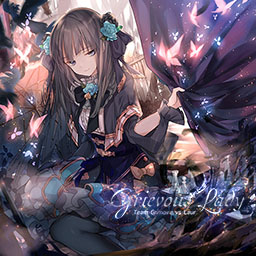
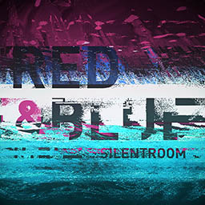

# ArcaeaSim

An [Arcaea](https://arcaea.lowiro.com/) simulator for viewing; no playing support is planned in a near future.

ArcaeaSim is built on [MilliSim](https://github.com/hozuki/MilliSim). Thus this is also a demonstration of the possibility of MilliSim.

ArcaeaSim is in alpha phase so please don't expect a splendid visual effect.
However, neither is it expected to go beyond the line to be a clone of Arcaea.

[Demo video](https://www.bilibili.com/video/av19881005/) (even before the initial commit; a very early technical preview so it may not look very appealing)

## Usage

*This section is for end users, using packaged binaries and resources.*

Like MilliSim, you will need:

- Operating System: Windows 7 SP1 or later
- [.NET Framework 4.5](https://www.microsoft.com/en-us/download/details.aspx?id=42642)
- [Visual C++ 2015 Runtime](https://www.microsoft.com/en-us/download/details.aspx?id=53587)
- [OpenAL](https://www.openal.org/downloads/)

There are four test songs included in the repo:

| [Grievous Lady](http://lowiro.wikia.com/wiki/Grievous_Lady) | [Metallic Punisher](http://lowiro.wikia.com/wiki/Metallic_Punisher_%28Song%29) | [Red and Blue](http://lowiro.wikia.com/wiki/Red_and_Blue) | [Snow White](http://lowiro.wikia.com/wiki/Snow_White) |
|---|---|---|---|
|  |  |  |  |

1. You can set the window properties (e.g. window size) in `Contents/app.config.yml`.
2. You can set the background image properties in `Contents/config/background_image.yml`.
3. You can configure which beatmap to load in `Contents/config/beatmap_loader.yml`.
4. You can set the background music properties in `Contents/config/audio_controller.yml`.
5. You can filter out the plugins that you don't want (e.g. the debug info overlay) by commenting them out (adding a "#" at the start of the line) in `Contents/plugins.yml`. But remember to keep the essential plugins.

Run the app with `--debug` switch to enable debug mode.

**Known issue(s)**:

- Some native Arcaea MP3s contain bad blocks (block sizes are inconsistent). When playing these songs ArcaeaSim will stop working and exit immediately.
If you turn on the debug mode you will see the MP3 format issue in error log. In this case, you need to convert these MP3 files using other tools
such as Foobar2000 and Audition, and feed ArcaeaSim with converted MP3 files.
- Windows 7 (w/ SP1) may raise [ACM](https://msdn.microsoft.com/en-us/library/windows/desktop/dd742945.aspx) "conversion not possible" exception if you play the MP3 files.
You can try to convert them to other formats, such as Wave audio files, and modify `audio_controller.yml` to load the converted files.

## Development

*This section is for developers.*

Before you start, please read [Starting.md](docs/Starting.md).

For building the solution, please read [Building.md](docs/Building.md).

## Contributing

Contributions (especially PRs) are welcome because I probably do not have much time digging too deep into this, or simply doing maintenance work.
Therefore it is not possible to make it good-looking (like that in Arcaea) only by myself.

Remember to fork this repo, create your own feature branch, and make a PR. Thank you.

Use English wherever you can. This makes it easier for contributors from various places to collaborate. :)

## License

The code is open-sourced under BSD 3-Clause Clear license.

However, the test music, beatmap, and image files are copyrighted materials of lowiro Games,
all rights reserved by their composers and beatmap makers.
